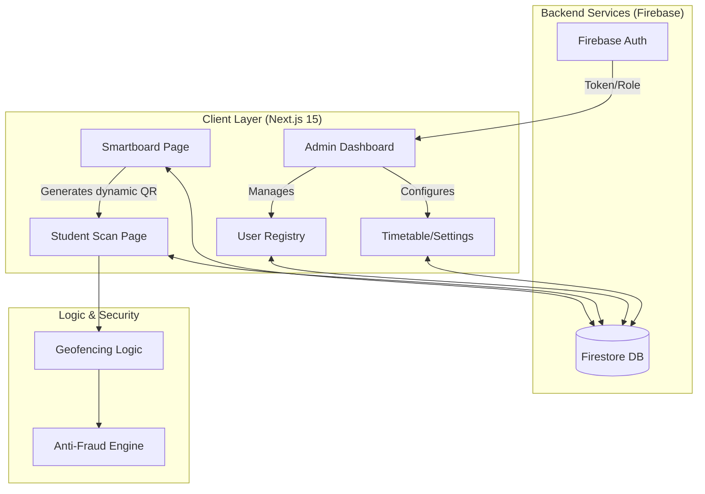

# 🎓 Attendify-v2

<div align="center">

**Next-Gen Attendance Verification System**

Secure, real-time, and fraud-proof attendance tracking for modern colleges using dynamic QR codes and geofencing.

[Features](#-features) • [Tech Stack](#-tech-stack) • [Installation](#-installation) • [Architecture](#-architecture)

</div>

---

## ✨ Features

### 🔐 Dynamic QR Codes
Anti-spoofing QR codes that refresh every 5 seconds to prevent photo sharing and ensure session security.

### 📍 Geofencing & Anti-Fraud
Students must be within 50 meters of the classroom to mark attendance. Includes mock location detection using GPS historical data correlation.

### 👥 Role-Based Access Control
- **👨💼 Admin** - Full system control, infrastructure management, user registry
- **👩🏫 Teacher** - Manage classes, view timetables, initiate Smartboard sessions
- **🎓 Student** - View schedules, scan QR codes, mark attendance

### 📊 Real-Time Smartboard
Live classroom session tracking with instant student scan synchronization and attendance grid visualization.

### 🏛️ Academic Infrastructure
Comprehensive management for Branches, Semesters, Subjects, and Timetables with high-density administrative controls.

---

## 🛠 Tech Stack

| Component | Technology |
|-----------|------------|
| **Framework** | Next.js 15 (App Router) |
| **Language** | TypeScript |
| **Database** | Firebase Firestore (Real-time) |
| **Authentication** | Firebase Auth (Custom RBAC) |
| **Styling** | Tailwind CSS v4 & Framer Motion |
| **QR Handling** | `html5-qrcode` (Scanning) & `react-qr-code` (Generation) |

---

## 🚀 Installation

### Prerequisites
- Node.js 20+ 
- Firebase project with Auth and Firestore enabled

### Setup Steps

1. **Clone the repository**
```bash
git clone https://github.com/AkashKumar-Behera/Attendify-v2.git
cd Attendify-v2
```

2. **Install dependencies**
```bash
npm install
```

3. **Configure Environment Variables 🔑**
Create a `.env.local` file in the root directory with your Firebase credentials exactly as shown below:
```env
# --- PUBLIC FIREBASE KEYS ---
NEXT_PUBLIC_FIREBASE_API_KEY=enter_your_api_key_here
NEXT_PUBLIC_FIREBASE_AUTH_DOMAIN=enter_your_auth_domain_here
NEXT_PUBLIC_FIREBASE_PROJECT_ID=enter_your_project_id_here
NEXT_PUBLIC_FIREBASE_STORAGE_BUCKET=enter_your_storage_bucket_here
NEXT_PUBLIC_FIREBASE_MESSAGING_SENDER_ID=enter_your_sender_id_here
NEXT_PUBLIC_FIREBASE_APP_ID=enter_your_app_id_here

# --- SERVER-SIDE FIREBASE ADMIN KEYS ---
FIREBASE_PROJECT_ID=enter_your_project_id_here
FIREBASE_CLIENT_EMAIL=enter_your_client_email_here
FIREBASE_PRIVATE_KEY="enter_your_private_key_here_with_quotes"
```

4. **Seed Master Admin Account**
Open `scripts/seed-admin.mjs`, update the email/password, and run:
```bash
node scripts/seed-admin.mjs
```

5. **Run Development Server**
```bash
npm run dev
```

---

## 🏗 Architecture

### Technical Flowcharts
For a high-fidelity technical infographic and engineering-level logic diagrams, visit the documentation hub:

👉 **[View Detailed System Flowcharts](./docs/FLOWCHART.md)**

### System Logic Overview


---

## 📁 Project Structure

```
Attendify-v2/
├── src/
│   ├── app/
│   │   ├── page.tsx              # Landing page
│   │   ├── login/                # Authentication
│   │   ├── dashboard/            # Main dashboard (Admin/Teacher/Student)
│   │   ├── smartboard/           # Classroom Smartboard interface
│   │   └── scan/                 # Student QR scanning page
│   └── components/              # Reusable UI components
├── docs/                         # Documentation (Flowcharts/Logs)
├── public/                       # Static assets
└── package.json                 # Dependencies
```

---

## 🎨 Design Philosophy

Attendify v2 features a **"Cyber-Noir"** aesthetic with:
- 🌑 Dark-themed interfaces with high contrast
- ✨ Glassmorphism effects and glowing borders
- 🎭 Smooth animations using Framer Motion
- 📱 Fully responsive design for all devices

---

## 📖 Development Workflow

Agents and developers MUST maintain the `docs/CONTEXT.md` file as a shared memory log.
*   **Pre-task**: Read `docs/CONTEXT.md` for latest state.
*   **Post-task**: Update with: `[YYYY-MM-DD HH:MM] | Agent: [Name] | Task: [Summary] | Status: [Done]`.

---

## 📄 License
This project is licensed under the MIT License.

---

## 👥 Authors
- **Akash Kumar Behera** - *Initial work*

---

<div align="center">

**Built for smart education 🎓**

[⬆ Back to Top](#-attendify-v2)

</div>
